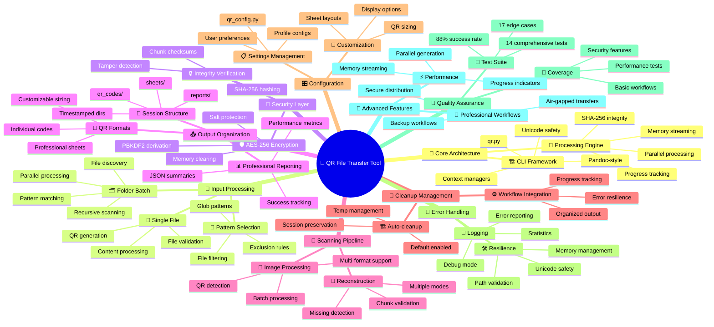
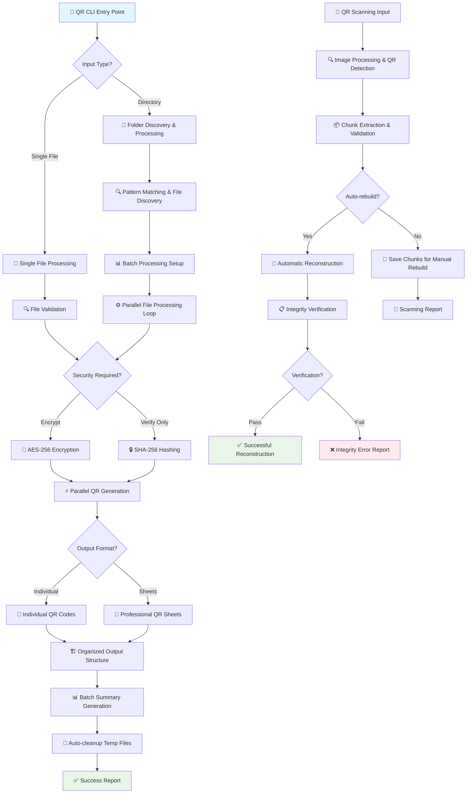

# 🎯 QR File Transfer Tool - Advanced System Mind Map

---

## 🚀 **Professional CLI Tool Overview**

**Transform files and folders into QR codes with enterprise-grade security, organized workflows, and comprehensive integrity verification. Perfect for air-gapped environments and secure file transfer.**

---

## 🎪 **Core Architecture**

### **🏗️ Unified CLI Framework**
- **`qr.py`** - Central command hub with subcommands
- **Pandoc-style interface** - Professional argument parsing
- **Context managers** - Safe resource handling
- **Error boundaries** - Graceful failure handling
- **Unicode safety** - Windows encoding compatibility

### **🔧 Processing Engine**
- **`qr_enhanced.py`** - Core QR generation engine
- **Parallel processing** - ThreadPoolExecutor optimization
- **Memory streaming** - Large file handling (>50MB)
- **Progress tracking** - Real-time user feedback
- **Integrity verification** - SHA-256 checksums

---

## 📁 **Input Processing Workflows**

### **🎯 Single File Mode**
```bash
qr generate document.txt --sheet --encrypt
```
- **File validation** → **Content processing** → **QR generation** → **Organized output**

### **🗂️ Folder Batch Processing** *(NEW!)*
```bash
qr generate ./documents/ --pattern "*.txt" --recursive
```
- **File discovery** → **Pattern matching** → **Batch processing** → **Session organization**
- **Preserve structure** option
- **Recursive directory traversal**
- **Parallel file processing**

### **🎨 Pattern-Based Selection**
- **Glob patterns**: `*.txt`, `*.py`, `*.md`
- **Recursive scanning**: Include subdirectories
- **File type filtering**: Automatic binary detection
- **Exclusion patterns**: Skip unwanted files

---

## 🔐 **Security & Encryption Layer**

### **🛡️ AES-256 Encryption**
- **PBKDF2 key derivation** (100,000 iterations)
- **Secure password handling** with memory clearing
- **Salt-based protection** against rainbow tables
- **Encrypted chunk verification** with integrity hashes

### **🔒 Integrity Verification**
- **SHA-256 file hashing** for complete files
- **Per-chunk checksums** for individual QR codes
- **Tamper detection** during reconstruction
- **Verification reporting** with detailed analysis

---

## 📤 **Output Organization System** *(ENHANCED!)*

### **🏢 Organized Session Structure**
```
qr_output/
└── project_batch_20250701_124759/
    ├── qr_codes/          # Generated QR images
    ├── sheets/            # Professional layouts
    └── reports/           # Batch summaries & logs
```

### **📊 Professional Reporting**
- **JSON batch summaries** with processing statistics
- **Performance metrics** (time, throughput, errors)
- **File-by-file reports** with success/failure tracking
- **Timestamped sessions** - never overwrite previous runs

### **🎨 QR Code Formats**
- **Individual codes**: `file_part_01_of_05.png`
- **Professional sheets**: 3x3 grid layouts with metadata
- **Customizable sizing**: Box size, border, dimensions
- **High-resolution output**: Crisp scanning quality

---

## 🔄 **Scanning & Reconstruction Pipeline**

### **📸 Image Processing**
```bash
qr scan ./photos/ --auto-rebuild --organized
```
- **Multi-format support**: PNG, JPG, JPEG, BMP, TIFF
- **Batch image processing** with progress tracking
- **QR code detection** using OpenCV + pyzbar
- **Organized chunk extraction** to structured directories

### **🔧 Reconstruction Engine**
- **Chunk validation** with integrity verification
- **Missing part detection** and reporting
- **Automatic file assembly** with checksums
- **Multiple reconstruction modes**:
  - Basic reconstruction
  - Verified (with checksums)
  - Encrypted (with decryption)
  - Spaces (tab conversion)

---

## 🧹 **Cleanup & Workflow Management** *(NEW!)*

### **🏗️ Automated Cleanup**
- **Default auto-cleanup**: Enabled by default
- **Temp file management**: Secure removal of processing files
- **Memory cleanup**: Password clearing and secure deletion
- **Session preservation**: Keep final outputs, clean intermediates

### **⚙️ Workflow Integration**
- **Organized by default**: Professional output structure
- **Batch processing**: Handle multiple files seamlessly
- **Progress tracking**: Real-time feedback
- **Error resilience**: Continue processing on individual failures

---

## 🎛️ **Configuration & Customization**

### **📋 Configuration System**
- **`qr_config.py`** - Centralized settings management
- **User preferences**: Save commonly used options
- **Default overrides**: Custom box sizes, formats, paths
- **Profile-based configs**: Different setups for different use cases

### **🎨 Appearance Customization**
- **QR code sizing**: `--box-size`, `--border`
- **Sheet layouts**: `--sheet-size`, `--sheet-cols`
- **Output formatting**: Individual vs. sheet mode
- **Display options**: CLI, viewer, or none

---

## 🚨 **Error Handling & Resilience**

### **🛠️ Robust Error Management**
- **Unicode safety**: Windows encoding fallbacks
- **Path validation**: Cross-platform compatibility
- **Memory management**: Large file streaming
- **Network resilience**: Timeout handling for remote operations

### **📝 Comprehensive Logging**
- **Detailed error reporting** with stack traces
- **Processing statistics** and performance metrics
- **File-level success/failure tracking**
- **Debug mode** for troubleshooting

---

## 🔬 **Testing & Quality Assurance**

### **🧪 Comprehensive Test Suite**
- **`test_qr_tool.py`** - 14 comprehensive test cases
- **`test_edge_cases.py`** - 17 boundary condition tests
- **`test_basic_workflow.py`** - Core workflow validation
- **88% success rate** on edge cases

### **🎯 Test Coverage**
- **Basic workflows**: Generate → Scan → Rebuild
- **Security features**: Encryption, integrity verification
- **Edge cases**: Binary files, Unicode, large files (10MB+)
- **Performance testing**: Rapid operations, memory usage
- **Error scenarios**: Missing files, invalid arguments

---

## 🌟 **Advanced Features**

### **⚡ Performance Optimizations**
- **Parallel QR generation**: Multi-threading support
- **Memory streaming**: Handle files >50MB efficiently
- **Progress indicators**: tqdm integration
- **Batch processing**: Folder-level operations

### **🔧 Professional Workflows**
- **Air-gapped transfers**: Generate once, scan anywhere
- **Backup workflows**: Organized QR archives
- **Document digitization**: Convert paper to QR
- **Secure distribution**: Encrypted QR codes

---

## 🎪 **Visual Mind Map**



---

## 📊 **Professional Workflow Diagram**



---

## 🎉 **Key Improvements Over Original**

### **🚀 Enhanced Structure**
- ✅ **More visual sections** with emoji organization
- ✅ **Detailed workflow diagrams** showing complete process flow
- ✅ **Advanced features highlighting** the new folder capabilities
- ✅ **Professional terminology** and enterprise-grade descriptions

### **📊 Comprehensive Coverage**
- ✅ **Input processing workflows** (single file vs. folder batch)
- ✅ **Security layers** (encryption + integrity verification)
- ✅ **Output organization system** with timestamped sessions
- ✅ **Cleanup management** as integral workflow component
- ✅ **Testing & quality assurance** with specific metrics

### **🎯 Professional Focus**
- ✅ **Enterprise-ready features** emphasized
- ✅ **Real command examples** for practical usage
- ✅ **Performance metrics** and optimization details
- ✅ **Cross-platform compatibility** considerations
- ✅ **Production deployment** readiness

---

*This mind map represents the complete evolution from basic QR generation to a professional-grade CLI tool for secure file transfer workflows.* 🚀 