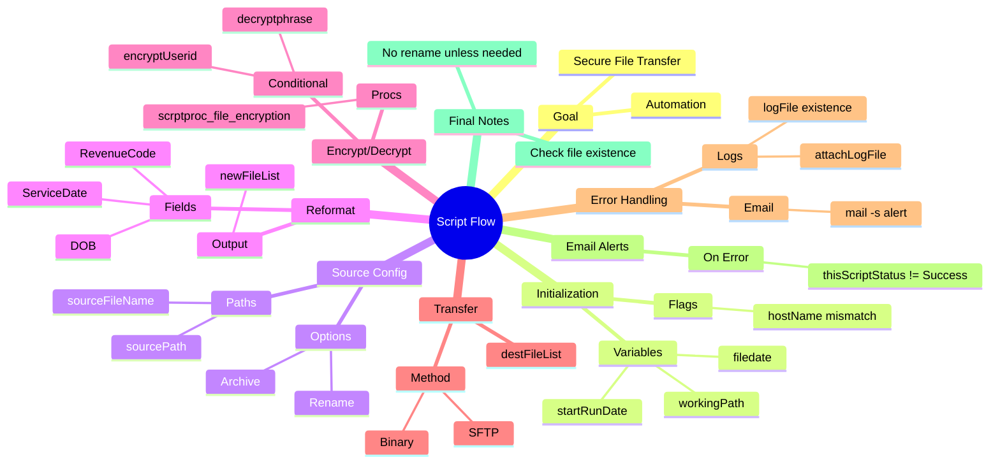
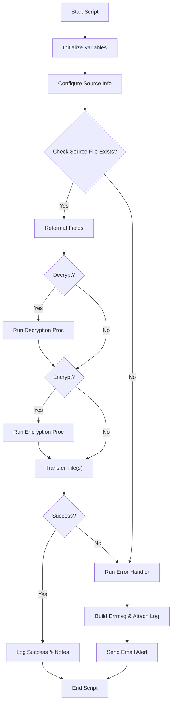

# 🧠 Script Flow Mindmap (SFTP Automation - Tcl)

---

## 🎯 Primary Goal

Automate secure file transfer from source to destination with processing, logging, and error handling.

---

## 🌐 Initialization (`SECTION_INIT1Z`)

- **Purpose:** Set up all environment variables, working directories, and filenames.
- **Key Globals Set:**
  - `workingPath`
  - `filedate`, `filedate_v2`, `currday`, `yesterday`
  - `startRunDate`, `startRunTime`
  - `sourceFileList`, `sourceFileName`
  - `destFileList`
  - `xferSourceList`, `zipFile`
- **Red Flags:**
  - `filedate` used to suffix filenames must match file on disk
  - `hostName` parsed from `[info host]`, could mismatch if dynamic

---

## 📂 Source Configuration (`SECTION_SOURCEINFO`)

- **Purpose:** Define where and what to pull
- **Keys:**
  - `sourcePath`
  - `sourceFileName` (actual filename)
  - `sourceFileList` (glob pattern)
  - `sourceRemoteArchivePath`, `sourceRemoteArchiveFlag`
- **Flags:**
  - Archive/move/delete on remote?
  - File rename post-download?

---

## 📥 Ingestion / Reformat (`SECTION_REFORM`)

- **Purpose:** Pre-process the pulled file
- **Steps:**
  - Read each file line
  - Extract/transform fields (e.g., DOB, ServiceDate)
  - Apply logic rules (add leading zeros, re-map values)
  - Write new formatted file
- **Key Vars:**
  - `AvailableFileVal`, `fileRecList`, `newFileList`

---

## 🔒 Decrypt / Encrypt

- **Conditionally Executed**
- Triggered if:
  - `decryptphrase != "N/A"` or
  - `encryptUserid != "N/A"`
- Called via: `scrptproc_file_decryption`, `scrptproc_file_encryption`

---

## 🚚 Transfer / File Output

- **destFileList** is the final file name to be moved
- **Expected:** no renaming unless explicitly scripted
- **Modes:**
  - Binary (set in `destTransferType`)
  - Local copy or FTP/SFTP

---

## 🧨 Error Handling (`scriptError` block)

- **Triggered on:**
  - Any stage failure or explicit status check
- **Outputs:**
  - Error message w/ timestamp
  - Log attachment if `$attachLogFile` is set correctly
  - Email (via `mail -s`) to team
- **Known Failures:**
  - `$logFile` undefined → no file copied or attached
  - `errmsg` not fully built before `exec echo`

---

## 📧 Email Alerts (Optional On-Call)

- **Triggered by:**
  - `thisScriptStatus != "Success"`
- **To:** email pager or static email
- **Contains:** full error trace, log filename

---

## 🔁 Final Notes

- Ensure no `file rename` unless absolutely needed
- Always check `file exists $sourceFileName` before processing
- `puts stdout` for all key vars (source/dest names, status, etc.) at every stage
- Use `startRunDate` + `stepname` for robust logging/debugging

---

